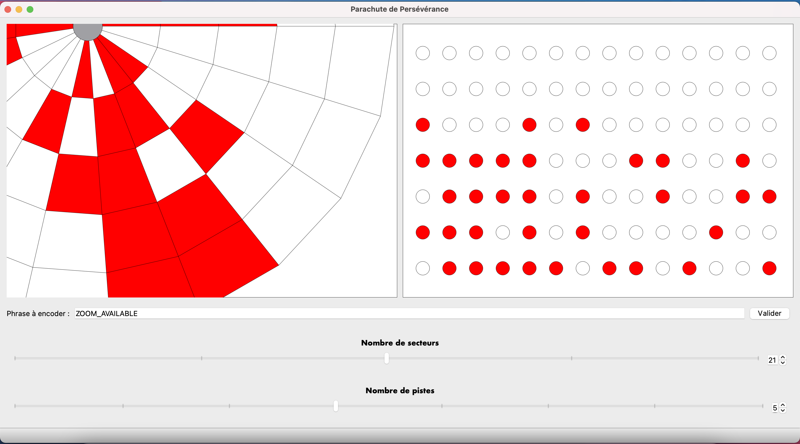
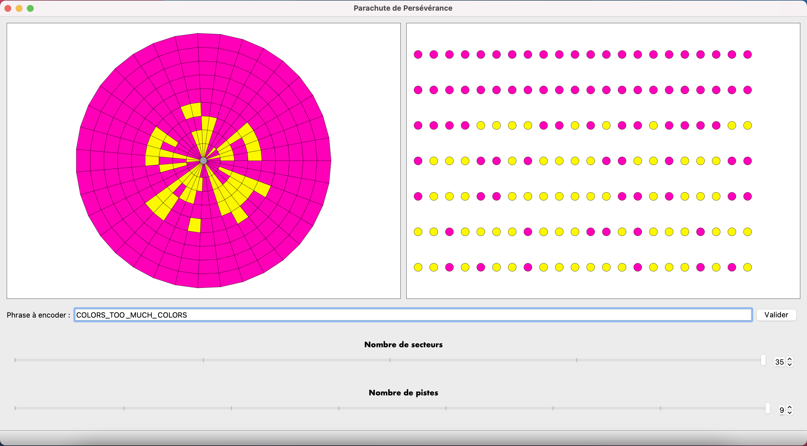
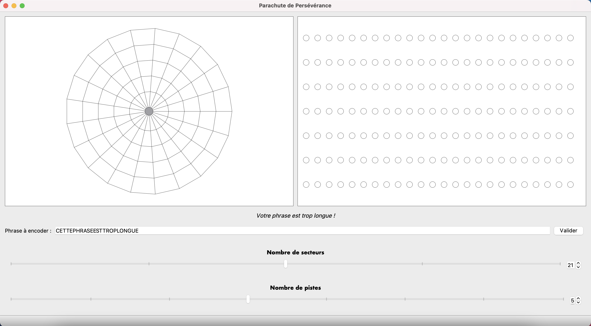
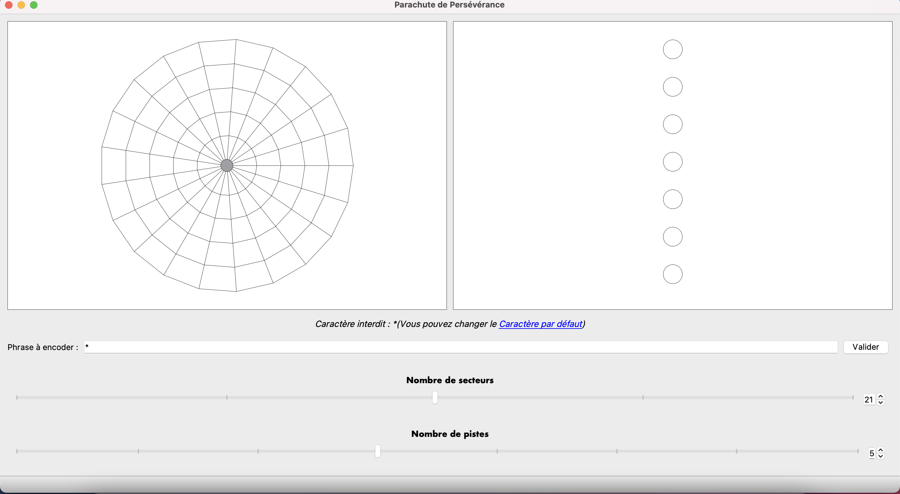
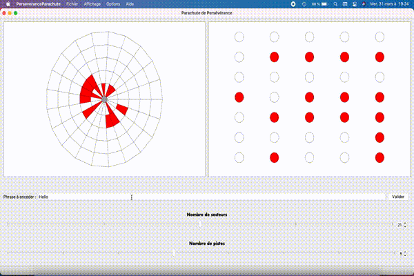

# Perseverance Parachute
## Graphical Interface - Groupe 2 - M. Ziad-Forest
## Maelise Castel - Julien Zaïdi
### ENSI 2021

#Commands
Build the app: <br>
```shell
cd PerseveranceParachute
mkdir bin
cd ./bin
qmake ../PerseveranceParachute.pro
make
```

#### Linux Commands for lauching the app : 
Run the app in English: <br>
```sh
LANGUAGE=en LC_ALL=us_EN ./PerseveranceParachute
```

Run the app in French: <br>
```shell
LANGUAGE=fr LC_ALL=fr_FR ./PerseveranceParachute
```

#### MacOs Command for launching the app : 
```shell
./PerseveranceParachute.app/Contents/MacOS/PerseveranceParachute
```
PS : There is no known command by us for launching the app in another 
locale than the one of your computer. 

#### Uninstall
Just remove the bin folder from your computer !
```shell
    cd ..
    rm -rf ./bin/
```


#Qt versions / OS
This application has been tested on Ubuntu 20.04 and macOS. Moreover, it has
been tested on two Qt versions : Qt 5.12.8 (on the Ubuntu OS) and Qt 5.15.2
(on the macOS).
  
#Pattern 
We used a MVC pattern as we did in the previous practical work. We choose
this one to respect the **Single responsibility principle**. Thanks to this, the
view doesn't have any logic except the ones concerning the drawing, all the
logic is deported to the Model (Message). The Controller (MainWindow) permits
to link the View and the Model.

#Implemented features
##The recommended ones
<ul>
    <li>A model class : Message <br>
    It describes a message, has the functions to encode the string and offers
    an access of the k_th bit.</li>
    <li>Number of tracks and sectors adjustable thanks to a spinbox and a
     slider. We created a custom widget that contains the slider and the
     spinbox, so that we can reuse this new widget for both the tracks and
     the sectors (and eventually other applications that would need this
     controllers).</li>
    <li>Standard menu with shortcuts for all of its possible actions.</li>
    <li>Translation of our app in French so that we can run it in French or
     in English depending on the language of the computer.</li>
    <li>Saving the current parameters of the app is possible. We can of
     course load a file that we previously saved, even if we closed the app
     after saving.</li>
</ul>

##The ones given in the subject (as improvements)
<ul>
    <li>Added a central disc to better imitate the real parachute.</li>
    <li>Possibility to change the default character. We can find this
     possibility in the menu Options.</li>
     <li>Possibility to choose the color of both the bits of 0 and the bits
     of 1. We can do it thanks to the View menu.</li>
     <li>Possibility to display blocs of 7 or 10 trapezoids. To change the
     number of blocs, we just need to check the action <em>Add 3 bits
     offset</em> in the Options menu (remember that there are shortcuts for
     EVERY actions in the menu bar).</li>
     <li>The number of sectors can be choose from multiples of the number of
     blocs (so multiples of 7 or 10).</li>
</ul>

##Our own additional features
<ul>
    <li>Zoom and drag the parachute. With your wheel, you can zoom-in and zoom
    -out the parachute. When you keep the left key of the mouse pressed when
     on the parachute, you can drag it on the window. If you do a bad
     manipulation, you can always go back to the initial view by clicking on
     <em>Reset default view</em> in the View menu.</li>
     <li>When you type a new sentence in the bar <em>encode sentence</em
     >, the validate button has a different style to point out the user that
      he must confirm his new sentence (by pressing enter or clicking on
      validate). Once the sentence is encoded, the validate button takes its
      initial style.</li>
      <li>Display a message when there is an error. Some errors can occur
      : you can type a too long sentence so that you can't have the whole
      string encoded and display on the parachute view -> a message is
      displayed to warn you. The second error is a character that is out of
      range. When it happens, a message is displayed to advise you to
      change the default character with a link to do it. The error message
      is displayed only 5 seconds to not disturb the user for too long.</li> 
</ul>

#Strengths of our application
<ul>
    <li>Responsive: We can change the size of the window and the whole
     application adapts.</li>
     <li>Reusable custom widgets: <br>
     - One containing the spinbox and the slider as explained before. We can
      reuse it in other applications if needed. Even if it contains the steps
      to get only the multiple values of either 7 and 10, by putting the
      step value to 1, its behavior is like a normal slider and a normal
      spinbox. <br>
      - The binary view. It is fully reusable even if its utilisation is more
      specific to special uses (require some function as defined in Message class). <br>
      - The parachute view, as the binary view, is fully reusable even if its
      utilisation is specific to special uses. <br>
      The 3 custom widgets are totally independent from each other.</li>
     <li>Basic ergonomy respected: <br>
     - The "3 dots" ... in the menu actions when it opens something
     . <br>
     - The & that permits to underline the first letter of the menu and its
      actions to permit the user to do alt+the underlined letter (which is
       the first letter). <br>
     - Shortcuts in the menu actions with the casual shortcut as ctrl+s to
      save or ctrl+q to quit the app.
     </li>
     <li>Single responsibility respected thanks to the MVC and the creation
      of auxiliary classes to write and read a file.</li>
    <li> Each action of the user has a visible consequence on the interface, 
        even an error, with the error message as described before.
    </li>
</ul>

#Weaknesses of our application
<ul>
    <li>
        Some reproched that the Parachute and the Binary view don't update as the user is
        typing. We have choosed the "Validate" action because at the moment we had to choose,
        it seemed more adapted for us. Although, there is no reason to switch to the suggested
        option (valueChanged), because there is no technical difficulty to switch, 
        the implementation of the model will not change for instance, we have just to
        change few connects/slots. 
    </li>
</ul>
There is no know bugs.

#Possible improvements
<ul>
     <li>Design of the parachute closer to the real one by having a "sawteeth
     " design instead of having only trapezoids.</li>
     <li>Adding the possibility to add 0001111111 1111111111 as end motif on
      each tracks. We didn't implement it because it throws some other
      question as "what are the separator characters between each word ? Is
      it only one word per track ?". We didn't have the time to treat those
      questions so we didn't implement this possibility.</li>
</ul>

# Some illustrations of our application 
**(all the feature are not represented here, it is just a preview of our app and it
shows that the app is running)**





## Here is a little GIF to give a preview

PS : The quality was reduced for archiving the app. 
